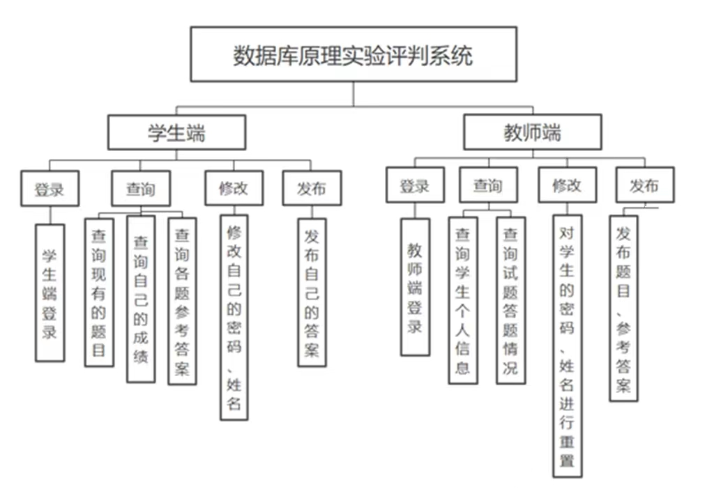
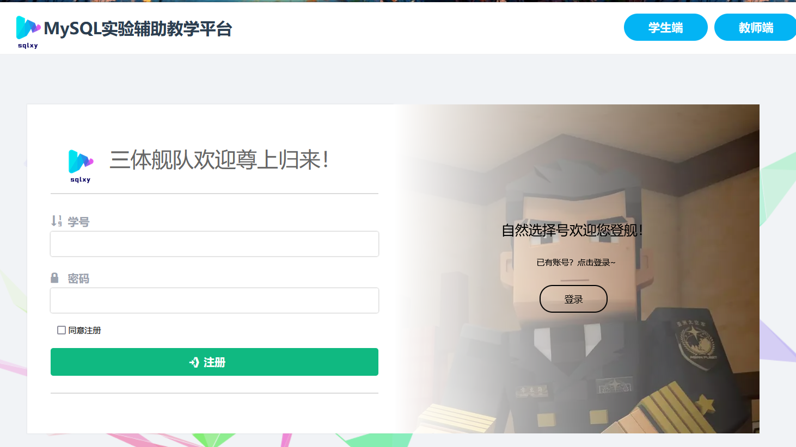
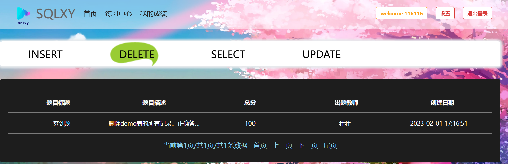
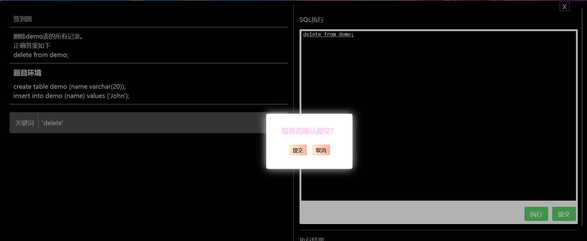
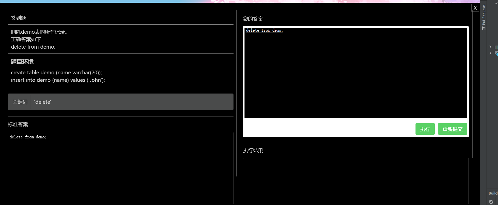
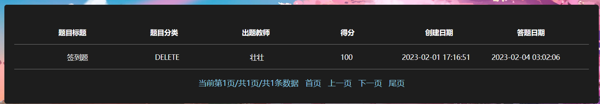
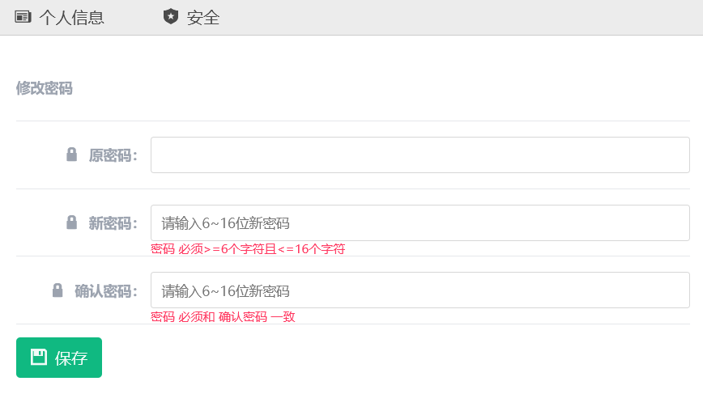
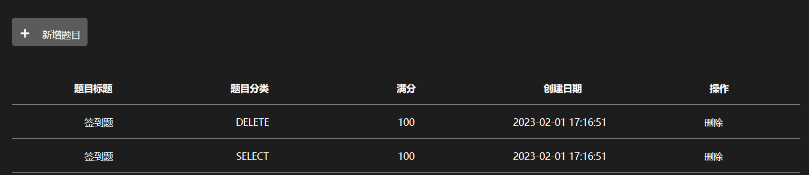
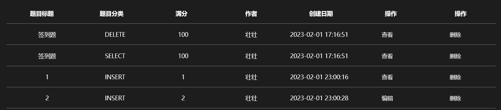

# 数据库原理实验评判系统

#### 团队简介

中国民航大学2022-05~2023-04的大学生创新创业项目，历时一年，学习时间有三四个月，实际开发时间约两个月。团队原五人，因9月踢出一枚混子现还剩四人 —— 指导老师：中国民航大学讲师暨中国矿业大学博士邢老师；前端工程师：AffettoIris；后端工程师：WenTesla；数据工程师：不能再睡了。

##### 项目中文全称

数据库原理实验评判系统

##### 主要功能

教师发布MySQL题目；学生答题。简单地说，大家或多或少用过PTA或者leetcode或者学习通吧，类似这些平台，我们的网站就是这么一个老师可以发布题目，学生可以答题的系统，不过题目限定是MySQL类型的题目哦。在线访问网址：http://sqlxy.pro

##### 技术栈

前端：html5 css3 es5
后端：php7
数据传输：ajax json
服务器：centos7 apache 
数据库：mysql8
仓库：git+github

##### 不足

后期开发由AffettoIris接管，一点框架都没用上，因为不会┭┮﹏┭┮，这导致开发地可慢了，一个有内容的页面，html接近100行，css250起步，js150行起步，php后端150行起步。

项目成品共8629行代码┭┮﹏┭┮。哎，下个项目必须全部用框架，不然我是狗🐶！

##### 开发经历

1. 2022-06-20至2022-08-03，学习，对于 Front-End Engineer来说是：html5+css3+javascript5;对于*Back-End Engineer*来说是：java+springboot+spring+springmvc+mybatis+jdbc+durid+thymeleaf模板引擎技术。后端我不知道，前端我反正学了720集课，呵~
2. 2022-08-04至2022-08-20,开发登录界面的前后端，并成功实现了用户的登录功能。
3. 2022-09-01至2022-09-15，开发学生答题页面的评判功能，我们针对MySQL最常用的增删查改四大功能，我们规划设计了对应的四种题型，并于九月中旬实现了对查询类题目的评判。
4. 2022-12-20至2023-01-10，学习了PHP7、AJAX和Git操作。
5. 2023-01-11至2023-01-31，基本完成剩余页面，包括老师发布题目、修改题目、管理学生账号等功能；包括学生获取题目、学生在线答题、机器评判学生的答案是对或错、学生考后查看答题情况等功能。

#### 软件架构

##### 系统功能模块图

（建议开加速器，不然网速慢导致无法展示效果图）

##### 系统的层次方框图

#### 安装教程

1. 运行环境：Centos7、Apache、MySQL8、PHP7（LAMP）
1. 数据库：sql.php里有完整的建库、建表、初始化表的MySQL语句。简而言之，有sqlxy库和envxy库，前者是本网站的系统库，包含student表、teacher表、type表、exercise表和answer表，分别存储学生账号、教师账号、题目分类、练习题和学生答案；后者是运行学生针对练习题所做的答案的库，在envxy库里系统将为学生创建专属的答题表并在该表中运行学生的答案，实现评判正误的功能。

#### 使用说明

1. 在线访问网址：http://sqlxy.pro

   备用网址：http://afetoiris.natapp1.cc/html/makeCollection.html

   ##### 学生端

2. 自行注册学生账号并登录：

3. 在练习中心页面，学生可查看题目简介，点击题目即可答题。在答题页面您可输入答案，然后点击执行或提交按钮。

   

   

4. 在我的成绩页面学生可查看成绩，点击题目可以查看正确答案、答案历史记录、重新作答。

   

   

5. 设置页面，学生可自行修改账号绑定的姓名和密码。

   

   

   ##### 教师端

6. 在用户管理页面，教师可帮助学生更改账号的姓名或密码。

   

7. 在发布题目页面，教师可发布和查看题目

   

8. 在题目管理页面，对于已经有学生做过的题目，为防止教师修改题目答案引起麻烦，仅支持教师查看题目；对于尚无学生答过题的练习，教师可编辑题目详情。

   

9. 设置页面，教师亦可自行修改自己的账号绑定的用户名或密码。

   

#### 参与贡献

#### AffettoIris寄语

1. 感谢中航大给予的机遇、感谢伟大的邢老师的谆谆教诲、感谢一直以来WenTesla于我的勉励，难忘每个与君奋战于图书馆的日子、感谢学姐”不能再睡了”以及同学们、室友们给予的帮助！

2. 软件已在中国版权保护中心申请软件著作权。技术是无价的，软件是开源的，open source ≠ free，您拿去开源或者二创都可以，记得申明来源。但是如果拿去商业行为比如未经授权就在咸鱼上售卖，我真的会生气的哦！后果很严重的哦！

3. 独木难成林，机器评判SQL语句是对或错其实是很难做的，最难的倒不是技术，而是思路。关于评判的核心代码，我参考了[Att1cusss/SQLOJ](https://github.com/Att1cusss/SQLOJ/tree/main/php)的代码，研读了他的源码我才有了思路，感谢这位老哥的open source，谢谢！

4. [本系统的Github仓库](https://github.com/AfetoIris/sqlxy.git)

   [立志成为全栈工程师的AffettoIris的个人博客](https://afetoiris.gitee.io)

   AffettoIris的邮箱：affettoiris@yeah.net

   对本项目有问题或者有二创之类的想法的，可以在Github上Issues或者联系我的邮箱，谢谢！
